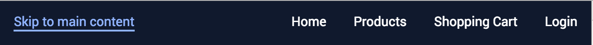

#### [Link to pages here](https://leoniesmits.github.io/cssttr/)

### Week 1 CSSTTR

This week we got started with CSSTTR. We are expected to build a keyboard-accessible website, made for Marijn as the user of this site. Marijn is a great programmer and loves beautiful design. He also has some physical constraints. The given components have to be styled accordingly, using only CSS. 

###### Step 1: 
##### The Concept

My first step was thinking up a concept that would fit all components inside. This isn’t a requirement and could even take up more time than it should, but by doing this I can stay within a specific purpose for my website. The semantic markup and guidelines for the user experience are explicit. This benefits my design and styling. The concept I came up with was a platform for sharing, sorting and connecting music. Songs and playlists are presented and the user can rate the labels given to music they have already listened to. This way, all songs are getting appropriate labels by their listeners. By rating labels on songs, users earn points they can use to “purchase” playlists, so they can contribute. This way, only users who actively rate labels for songs can contribute to playlists. All components are given a purpose in this design. This concept will take up some more time than just putting the components on one page without any meaning or purpose, but will help me empathize with the user and benefit the design. 

###### Step 2: 
##### Research

Before getting started, I wanted to know more about CSS grid. I had to refresh my memory and learn about responsive designs using CSS grid. I watched [this YouTube video](https://youtu.be/7kVeCqQCxlk?t=18m1s). The usage of CSS grid as opposed to FlexBox and the benefits in responsive design are really well explained. It’s shown how to give grid areas (cells) a name and then use that name for the element assigned to those cells. By doing this, only the template rows and columns have to be redefined when the screen width changes. 

A second thing I had to look up, were the best practices for keyboard accessibility. Things like "skip to main"- and "back to top" buttons and styling the :focus and :active elements are examples of practices I'd like to add to my pages. 

###### Step 3: 
##### Actually start writing something

The first thing I did was starting my page with the "navigation.html" component. Before this navigation, a skip to main has to be available. 
```html
<a href="#main">Skip to main content</a>
```
This line is the first one in the body. This skips the <nav> and jumps right to this line:
```html
<main id="main" tabindex="-1">
```
The href in the first line is linked to this ID. The [tabindex](https://developer.mozilla.org/nl/docs/Web/HTML/Global_attributes/tabindex) "indicates if its element can be focused, and if/where it participates in sequential keyboard navigation". I used value "1" because it means the element should be focusable in sequential keyboard navigation, with its order defined by the value of the number.

I did the same with a back to top button, an "a" element at the bottom of main that directs back to body. This way, the tabbing doesn't have lead to changing the URL and getting stuck there. Stay tabbing, and you will get back to the first "skip"-button and get back to the main content. 

###### Step 4:
##### Styling something

I want the "skip"-button to not be visible, unless the user is using their keyboard for navigation. The :focus and :active attributes are perfect for this practice. 
```CSS
a[href="#main"] {
    position: absolute;
    top: auto;
    width: 1px;
    height: 1px;
    overflow: hidden;
    z-index: -10;
}
a[href="#main"]:focus,
a[href="#main"]:active {
    color: #fff;
    background-color: #000;
    top: auto;
    width: 30%;
    height: auto;
    overflow: auto;
    z-index: 10;
}
```
This makes sure the link element is hidden at first and doesn't influence the rest of the elements by using position:absolute. To support the tabbing even more, I used :focus-within on the article elements, so it's clear at all times what item is focussed.

I also added some @media (min-width)'s to later use for the CSS grid. The first CSS I've written is mobile first, so the expansion of the design comes later. 

###### Step 5
##### The assigned additions

The fancy ampersand is the first thing I added from the book. The method of putting a span around the ampersand and working the CSS on that class works, but is messy. We have to style only one character, so the font stacks are used. It will only be used for that one character, and all others will get the second, third, etc. font from our font stack.


## Week 2 CSSTTR

This week, it's a lot more clear as what to do for the final assignment. Sadly, I now know I have to do a lot to hand in everything I wanted to make. Best thing to do now is make a planning and strictly stick to it.

#### Weekly planning

##### 13/02
- [x] __Complete the HTML as it should be.__
    - [x] Check if all the right elements are there (like the "lang" attribute). 
    - [x] Watch the semantic markup, a couple of articles should be in a section.
    - [x] Add all the pages I want to make and write some content so the components make sense. 
- [ ] __Style everything I have now (on the main page).__
    - [x] Make sure the nav as it is in components is accessable through tabs in a dropdown.
    - [ ] Make the remaining assignments from last week from the CSS book.
    - [x] Use custom properties for the colors. 
    - [x] Add the grid in the media queries.
    - [x] Make sure the page is styled for :focus
- [ ] __This weeks assignments (at least read them all).__ (read but not used yet)
    - [ ] Loading spinner — 8.43
    - [ ] Transitions op :hovers en :focus—8.42
    - [ ] Cursor—6.29
    - [ ] Extending the clickable area—6.30
    - [ ] Custom checkboxes—6.31
    - [ ] (Pseudo)random background—2.7
    - [ ] [Validatie van het formulier](https://codepen.io/joostf/pen/VKyPxk)

##### 13 or 14 or 15 / 02
- [x] __Read the articles for CSSTTR and make sketchnotes.__
    - [x] [CSS inheritance](https://www.smashingmagazine.com/2016/11/css-inheritance-cascade-global-scope-new-old-worst-best-friends/)
    - [x] [Semantic CSS and selectors](https://www.smashingmagazine.com/2013/08/semantic-css-with-intelligent-selectors/)
    - [x] [Semantic CSS and the framework](https://www.ebayinc.com/stories/blogs/tech/how-our-css-framework-helps-enforce-accessibility/)

##### 15/02
- [ ] __Finish the log-in field.__
    - [ ] Fancy transitions and :focus
    - [ ] Make clear transitions that actually help the user
- [ ] __Work out the detail-page.__
    - [ ] Accessable through tabs
    - [ ] Make sure all the HTML is correct
    - [ ] Style it
    - [ ] Add the rating component and style it.
- [ ] __Make the chatbox-component.__
    - [ ] Style it 
    - [ ] Make accessable

- [ ] __Make sure everything from 13/02 is finished, repeat this planning if not.__

##### 16/02 
- [ ] __Push everything on a new branch before 09:37!!!__

## A few things I did and learned this week:

###### 1: 
##### The nav, accessable through tabs with a dropdown and skip to main

First, I styled the a elements in the nav that direct to some element in the main. 

```css
a[href="#main"] {
    position: relative;
    display: inline-block;
    width: 0;
    height: 0;
    overflow: hidden;
    z-index:-10;
}
a[href="#main"]:focus,
a[href="#main"]:active {
    width: auto;
    height: auto;
    overflow: visible;
    z-index: 10;
}
```
The a element has no width or height and has a negative index, just to be sure. Then, on focus and active, the width and height are given. The elements are only visible when using tab, because this applies only to users who will perfer this on the mouse.

Seconldly, I made a dropdown in the nav that is keyboard accessable. The nav is made up like this: 
```css
nav > ul > li > a > ul > li > a
```
I had to make sure I only select the last ul to make invisible. I decided to use display: none, since this tab can be directed through the previous a element. The CSS looks like this:
```CSS
ul li ul li a {
    display: none;
    visibility: hidden;
 }

ul li:focus-within ul li a,
ul li:hover ul li a {
    display: inline-block;
    visibility: visible;
    position: relative;
 }
 ```
 The display: none hides the text and visibility: hidden makes sure all styling that comes with li or ul are eliminated. Then I select the ul, only if the previous a is hovered or focussed. This way, I can make the a drop down by touching the li in the nav.


###### 2:
##### A fancy underline with transition under the active a element.

On the li a selector, I added text-decoration: none and padding: 0.5em. Then I added an ::after and put some empty content in display: block and a transition for width. Then I added another li a, this time with :focus::after and :hover::after. In here, I only put width: 100% to show the ::after element only on these states and creating a fat underline with a small transition.
```CSS
li a {
    padding: 0.5em;
    display: inline-block;
    color: var(--light);
    text-decoration: none;
    font-size: 0.7em;
}

li a::after {
    content: '';
    display: block;
    width: 0;
    height: 2px;
    background: currentColor;
    transition: width .3s;
}

li a:focus::after,
li a:hover::after {
    width: 100%;
}
```
###### Step 1: 
##### Things I don't get to show off yet

Other things I did where figuring out the CSS Grid and starting with custom properties. The CSS Grid works as it should right now, but the next step is to add grid-areas so the elements don't have to be defined in every mediaquery. They can be given a grid-area once, to later only edit the grid layout on main.

The custom properties are working well, even though I didn't really do anything yet to prove why it's so powerfull. First, I have to finish up the styling and the practices from the book.


## Week 3 CSSTTR

Everything has to be finished in just a week, so it's important to keep track with what I still need to do. Set priorities straight and keep to this planning. 

#### Weekly planning

##### 22/02
- [ ] __Complete the homepage.__
    - [x] Make it pretty
    - [ ] Write some more content
    - [x] Watch the semantic markup.
    - [ ] Add all the pages I want to make and write some content so the components make sense.
- [ ] __Implement all practices from the book.__
    - [ ] Custom checkboxes (form)
    - [ ] Extending clickable area (the articles and maybe step-indicator)
    - [ ] Dimming (want to use this on the detail to direct to the rating)
    - [ ] Blurring (same as above)
    - [ ] Intrinsic sizing (the figure element)
    - [ ] Transitions (everywhere!)
    - [ ] Loading spinner (after logging in)
- [ ] __Finish the log-in field.__
    - [ ] Fancy transitions and :focus
    - [ ] Make clear transitions that actually help the user
    - [ ] Use the practices from the book to help with the checkboxes
    - [ ] Use styling to validate the form
- [ ] __Work out the detail-page.__
    - [ ] Accessable through tabs
    - [ ] Make sure all the HTML is correct
    - [ ] Style it, use practices from book
    - [ ] Add the rating component and style it.
- [ ] __Style the chatbox-component.__
    - [ ] Give more styling
    - [ ] Make accessable (figure out how)
